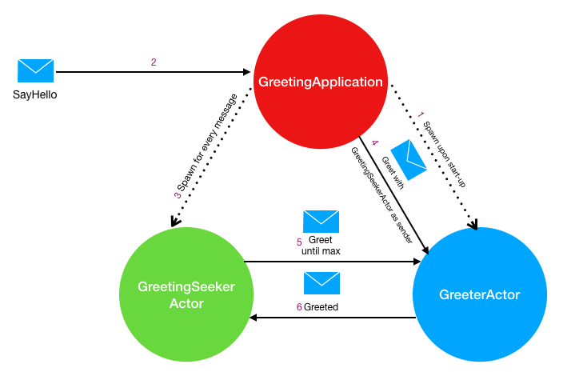

# Akka typed

This application show cases a simple hello-world like application using typed actors in Akka. Three actors are involved in this application; namely

- **GreeterActor**: Responds to '_Greet_' request message with a '_Greeted_' response message 
- **GreetingSeekerActor**: Responds to '_Greeted_' message. Requires the 'number of time to greet' (n) as an input and sends a request to the _GreeterActor_ to ensure 'n' '_Greeted_' messages are received by this actor. 
- **GreetingApplication**: Creates a single child 'GreeterActor' and a child 'GreetingSeekerActor' for each '_SayHello_' request message it receives. The 'name' attribute of SayHello message is utilised to forward the request to its child 'GreeterActor'.

 ------------
 
 
 ------------